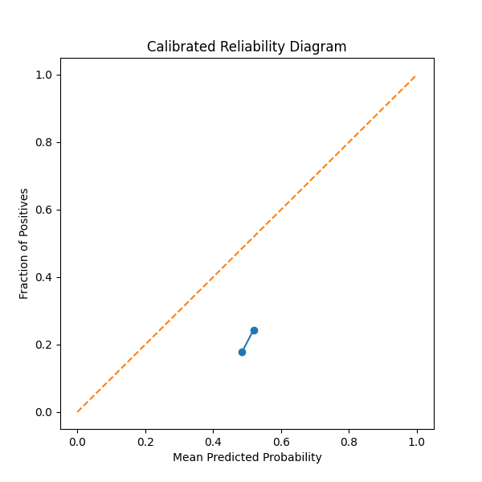

# DICOM-First Chest X-Ray Classification with Uncertainty Quantification

A trustworthy medical imaging pipeline for pneumonia detection from raw chest X-ray DICOM files using Deep Learning, Monte Carlo Dropout, and calibration analysis.

---

## Overview

This project implements an end-to-end medical imaging workflow for chest X-ray analysis using raw DICOM images from the RSNA Pneumonia Detection Challenge dataset.

Unlike standard image classification projects that rely on preprocessed PNG/JPG files, this pipeline works directly with DICOM radiographs and incorporates uncertainty estimation and calibration techniques commonly used in trustworthy clinical AI systems.

The project focuses on:

- Raw DICOM ingestion
- Medical image preprocessing
- DenseNet121-based classification
- Monte Carlo Dropout uncertainty estimation
- Reliability diagrams and Expected Calibration Error (ECE)
- Temperature scaling calibration
- Experiment tracking with MLflow

---

## Key Features

### Medical Imaging Pipeline
- Raw DICOM loading using `pydicom`
- Metadata parsing
- Chest X-ray preprocessing
- Medical image augmentation

### Deep Learning
- DenseNet121 backbone
- Transfer learning using pretrained weights
- Binary pneumonia classification

### Trustworthy AI
- Monte Carlo Dropout
- Predictive uncertainty estimation
- Reliability diagrams
- Expected Calibration Error (ECE)
- Temperature scaling calibration

### Engineering
- Modular project structure
- MLflow experiment tracking
- Kaggle GPU training workflow
- GitHub-integrated reproducibility

---

## Dataset
This project currently focuses on binary pneumonia detection using the RSNA Pneumonia Detection Challenge dataset as a foundational DICOM pipeline.

Future work will expand the system toward multi-label thoracic pathology classification using datasets such as NIH ChestXray14 and MIMIC-CXR.

This project uses the:

**RSNA Pneumonia Detection Challenge Dataset**

- Chest radiographs stored in raw DICOM format
- Pneumonia annotations and bounding boxes
- ~26k chest X-rays

Dataset:
https://www.kaggle.com/c/rsna-pneumonia-detection-challenge

---

## Project Structure

```bash
dicom-cxr-uncertainty/
│
├── configs/
├── notebooks/
├── results/
│   ├── metrics.csv
│   └── reliability_diagram.png
│
├── src/
│   ├── calibration/
│   ├── datasets/
│   ├── evaluation/
│   ├── models/
│   ├── training/
│   ├── uncertainty/
│   └── utils/
│
├── requirements.txt
├── train.py
└── README.md
```

---

## Model Architecture

- Backbone: DenseNet121
- Framework: PyTorch
- Input Resolution: 224×224
- Loss Function: BCEWithLogitsLoss
- Optimizer: AdamW

DenseNet architectures are widely used in medical imaging because of their strong feature reuse and parameter efficiency for radiographic analysis. :contentReference[oaicite:1]{index=1}

---

## DICOM Processing Pipeline

The project directly processes DICOM radiographs using `pydicom`.

Pipeline:
1. Read DICOM file
2. Extract pixel array
3. Normalize pixel intensities
4. Convert grayscale → 3-channel tensor
5. Apply medical augmentations
6. Feed into DenseNet121

Important metadata explored:
- View Position
- Photometric Interpretation
- Pixel Spacing
- Modality

This mimics real-world medical imaging workflows more closely than standard RGB pipelines.

---

## Training

Training was performed on Kaggle GPUs using PyTorch.

### Training Configuration

| Parameter | Value |
|---|---|
| Backbone | DenseNet121 |
| Batch Size | 16 |
| Learning Rate | 1e-4 |
| Optimizer | AdamW |
| Input Size | 224×224 |
| Epochs | 3 |

---

## Results

### Baseline Validation Performance

| Metric | Value |
|---|---|
| Validation AUROC | 0.7649 |
| ECE Before Calibration | 0.2866 |
| ECE After Calibration | 0.2843 |
| Temperature Scaling | 1.2410 |

### Notes on Current Results

These results represent an initial baseline obtained after only 3 training epochs on Kaggle GPU resources using a DenseNet121 backbone.

The primary objective of this phase was validating the end-to-end DICOM-first pipeline, uncertainty estimation workflow, and calibration framework rather than maximizing benchmark performance.

Published RSNA Pneumonia Detection baselines typically achieve higher AUROC scores (~0.85–0.90+) with:
- longer training schedules
- larger input resolutions
- stronger augmentation pipelines
- learning rate scheduling
- ensembling
- more extensive hyperparameter tuning

Future iterations of this project will focus on improving predictive performance and extending the system to multi-label pathology classification.

---
### Calibration Analysis

Temperature scaling produced only marginal ECE improvement in the current baseline configuration.

This likely indicates:
- insufficient model convergence
- limited confidence separation after short training
- the need for longer optimization schedules before post-hoc calibration becomes highly effective

Future work includes:
- longer training
- focal loss
- improved calibration techniques
- confidence-aware optimization


## Reliability Diagram

The project evaluates calibration quality using reliability diagrams and Expected Calibration Error (ECE).



---

## Monte Carlo Dropout Uncertainty Estimation

Monte Carlo Dropout was used to estimate predictive uncertainty by enabling dropout layers during inference and performing multiple stochastic forward passes.

Example:
- Mean Prediction: 0.5277
- Prediction Variance: 0.003903

This allows the system to identify uncertain predictions, an important requirement for medical AI deployment. Recent medical AI research increasingly emphasizes uncertainty-aware chest X-ray systems. :contentReference[oaicite:2]{index=2}

---

## Experiment Tracking

Experiments are tracked using MLflow.

Tracked metrics include:
- Training loss
- Validation loss
- AUROC
- Calibration metrics
- Hyperparameters

---

## Installation

```bash
git clone https://github.com/ARRY7686/dicom-cxr-uncertainty.git

cd dicom-cxr-uncertainty

pip install -r requirements.txt
```

---

## Run Training

```bash
python train.py
```

---

## Future Work

Planned improvements:
- Multi-label pathology classification
- Grad-CAM explainability
- Vision Transformers
- MIMIC-CXR integration
- Advanced calibration methods
- External validation datasets

---

## References

- RSNA Pneumonia Detection Challenge
- DenseNet: Densely Connected Convolutional Networks
- On Calibration of Modern Neural Networks
- TorchXRayVision :contentReference[oaicite:3]{index=3}
- Chest X-ray medical imaging pipelines :contentReference[oaicite:4]{index=4}

---

## License

MIT License
